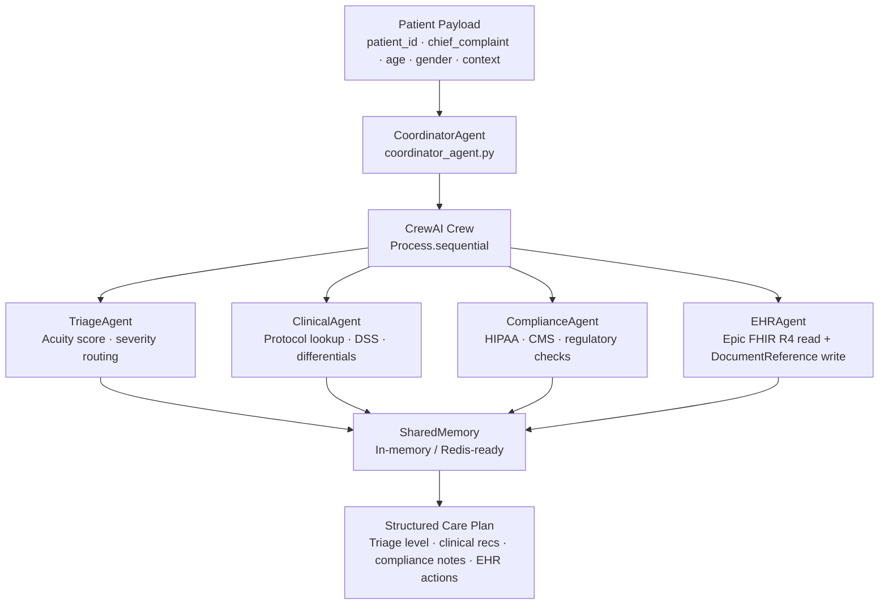

<div align="center">

<br />

# 🏥 W.O.R.L.D.

**Workflow Orchestration & Real-time LLM Dispatch**  
**A production-grade multi-agent system for clinical healthcare.**

Every enterprise health system has the same problem: patient encounters touch triage, clinical decision support, regulatory compliance, and EHR documentation — each handled by a different system, a different team, and a different latency.

W.O.R.L.D. collapses that into a single orchestrated agent pipeline. One patient payload in. One structured care plan out.

<br />

[](https://github.com/jsfaulkner86/world-multi-agent-system-for-healthcare/stargazers)
[](https://github.com/jsfaulkner86/world-multi-agent-system-for-healthcare/network/members)
[](https://github.com/jsfaulkner86/world-multi-agent-system-for-healthcare/issues)

<br />

[](https://python.org)
[](https://crewai.com)
[](https://langchain.com)
[](https://hl7.org/fhir/R4/)
[](https://fhir.epic.com)
[](https://openai.com)
[](#memory-layer)
[](LICENSE)

<br />

[Agent Reference](#agent-reference) · [Tool Reference](#fhir-tool-reference) · [Architecture](#architecture) · [Quick Start](#quick-start) · [Failure Modes](#known-failure-modes) · [Portfolio](#use-it-with-this-portfolio)

<br />

</div>

---

## The Problem This Solves

A patient presents with a high-risk women's health complaint. That encounter needs:

1. **Triage** — acuity score, routing decision, urgency flag  
2. **Clinical decision support** — protocol lookup, differential, care pathway  
3. **Compliance check** — HIPAA audit, CMS requirements, regulatory constraints  
4. **EHR documentation** — FHIR R4 read, structured note creation, Epic write  
5. **Synthesis** — a coherent care plan that reconciles all four outputs  

Today, each of those happens in a silo. Different systems. Different teams. Different latency. The clinician assembles the result manually.

W.O.R.L.D. runs all five as a **coordinated agent crew** — sequentially, with shared memory and a structured output — in a single orchestration pass.

---

## Architecture

```
┌──────────────────────────────────────────────────────────────┐
│                      CoordinatorAgent                        │
│              (CrewAI Master Orchestrator)                    │
└──────┬───────────┬───────────┬──────────────┬───────────────┘
       │           │           │              │
  TriageAgent  ClinicalAgent  ComplianceAgent  EHRAgent
  (Acuity +   (Protocol +    (HIPAA + CMS +   (Epic FHIR R4
   Routing)    DSS)           Regulatory)      Read + Write)
       │           │           │              │
       └───────────┴───────────┴──────────────┘
                           │
                    SharedMemory
                  (In-memory / Redis)
                           │
                  Structured Care Plan
```



---

## Agent Reference

| Agent | File | Role | Tools |
|---|---|---|---|
| `CoordinatorAgent` | `agents/coordinator_agent.py` | Master orchestrator — builds the CrewAI crew, routes tasks sequentially, synthesizes final output | All sub-agents |
| `TriageAgent` | `agents/triage_agent.py` | Intake processing, acuity classification, severity scoring, routing decision | `analytics_tools` |
| `ClinicalAgent` | `agents/clinical_agent.py` | Clinical decision support, protocol lookup, differential generation, care pathway selection | `fhir_tools`, `analytics_tools` |
| `ComplianceAgent` | `agents/compliance_agent.py` | HIPAA audit, CMS requirements, regulatory constraint checking | Internal policy rules |
| `EHRAgent` | `agents/ehr_agent.py` | FHIR R4 patient data retrieval, clinical note creation via `DocumentReference` | `fhir_tools`, `ehr_tools` |

---

## FHIR Tool Reference

All FHIR tools authenticate via **SMART on FHIR Backend Services** (RS384 JWT → Bearer token) against Epic FHIR R4.

| Tool | FHIR Resource | Description |
|---|---|---|
| `get_patient` | `Patient` | Demographics, identifiers, contact info by patient ID |
| `get_observations` | `Observation` | Vitals and labs — category-filtered (`vital-signs` default) |
| `get_medications` | `MedicationRequest` | Active prescriptions with dosage context |
| `get_conditions` | `Condition` | Active problem list with clinical status filter |
| `create_note` | `DocumentReference` | Base64-encoded clinical note creation in Epic |
| `get_analytics` | Internal | Population-level analytics and risk signal aggregation |

> All tools use `@tool` (LangChain decorator) — compatible with CrewAI, LangGraph, LangChain, and AutoGen without modification.

---

## Memory Layer

`SharedMemory` (`memory/shared_memory.py`) provides a keyed context store that persists agent outputs across the crew execution and makes them available for downstream synthesis.

```python
# Coordinator stores final result keyed by patient_id
self.memory.store(task_payload.get("patient_id"), result)

# Any downstream agent or external caller can retrieve
context = self.memory.retrieve(patient_id)
```

**Production upgrade path:** The in-memory dict is a direct drop-in swap for Redis. Set `REDIS_URL` in your `.env` and swap `SharedMemory` for a Redis-backed implementation — no agent code changes required.

---

## Quick Start

```bash
# 1. Clone
git clone https://github.com/jsfaulkner86/world-multi-agent-system-for-healthcare.git
cd world-multi-agent-system-for-healthcare

# 2. Virtual environment
python -m venv venv
source venv/bin/activate  # Windows: venv\Scripts\activate

# 3. Install
pip install -r requirements.txt

# 4. Configure
cp .env.example .env
# Fill in OPENAI_API_KEY, EPIC_FHIR_BASE_URL, SMART credentials

# 5. Run
python main.py
```

### Environment Variables

```env
OPENAI_API_KEY=your_key_here
OPENAI_MODEL=gpt-4o

EPIC_FHIR_BASE_URL=https://fhir.epic.com/interconnect-fhir-oauth/api/FHIR/R4
SMART_TOKEN_URL=https://fhir.epic.com/interconnect-fhir-oauth/oauth2/token
SMART_CLIENT_ID=your_client_id
SMART_PRIVATE_KEY_PATH=./keys/private_key.pem
```

**Epic FHIR Sandbox:** [fhir.epic.com](https://fhir.epic.com) — free registration, full R4 resource access for development.

---

## Example Payload

```python
from agents.coordinator_agent import CoordinatorAgent

coordinator = CoordinatorAgent()

result = coordinator.run({
    "patient_id": "erXuFYUfucBZaryVksYEcMg3",   # Epic sandbox patient ID
    "chief_complaint": "Postpartum hemorrhage risk — 36h post-delivery",
    "age": 29,
    "gender": "female",
    "context": "Vaginal delivery, estimated blood loss 450mL, currently tachycardic"
})

print(result)
# → Structured care plan: triage level, clinical recommendations,
#   compliance notes, EHR actions
```

---

## Project Structure

```
world-multi-agent-system-for-healthcare/
├── main.py                        # Entry point
├── agents/
│   ├── coordinator_agent.py       # CrewAI master orchestrator
│   ├── triage_agent.py            # Acuity + severity routing
│   ├── clinical_agent.py          # Clinical DSS + protocol lookup
│   ├── compliance_agent.py        # HIPAA + CMS + regulatory
│   └── ehr_agent.py               # Epic FHIR R4 read/write
├── tools/
│   ├── fhir_tools.py              # SMART-on-FHIR FHIR R4 LangChain tools
│   ├── ehr_tools.py               # EHR utility tools
│   └── analytics_tools.py         # Population analytics + risk signals
├── memory/
│   └── shared_memory.py           # In-memory / Redis-ready context store
├── config/
│   ├── settings.py                # Pydantic settings
│   └── oauth.py                   # SMART Backend Services token exchange
└── tests/                         # Unit tests
```

---

## Known Failure Modes

| Failure Mode | Impact | Mitigation |
|---|---|---|
| CrewAI sequential process bottleneck | Agent N blocked until Agent N-1 completes | Evaluate `Process.hierarchical` for parallel-eligible tasks; add per-task timeout |
| Epic FHIR rate limiting under load | FHIR tool calls fail mid-crew | Exponential backoff in `fhir_tools.py`; pre-fetch patient bundle before crew kickoff |
| SharedMemory key collision across concurrent runs | Patient context overwritten | Namespace keys by `patient_id + run_id`; upgrade to Redis with TTL in production |
| PHI in agent verbose logs | Unmasked PHI in stdout/loguru output | Disable `verbose=True` in production; route through [`healthcare-compliance-guardrail`](https://github.com/jsfaulkner86/healthcare-compliance-guardrail) |
| RS384 token expiry during long crew execution | Silent FHIR auth failure mid-task | Pre-expiry token refresh with 5-min rotation buffer in `oauth.py` |
| Compliance agent hallucinated regulatory reference | False compliance clearance | Add citation grounding + [`verity`](https://github.com/jsfaulkner86/verity) confidence scoring on compliance output |

---

## Use It With This Portfolio

W.O.R.L.D. is the orchestration spine. The rest of the portfolio plugs into it:

| Repo | Integration Point |
|---|---|
| [`ehr-mcp`](https://github.com/jsfaulkner86/ehr-mcp) | MCP-native EHR layer — replace `ehr_tools.py` for any-framework FHIR access |
| [`verity`](https://github.com/jsfaulkner86/verity) | Confidence scoring on clinical and compliance agent outputs |
| [`ai-killswitch-protocol`](https://github.com/jsfaulkner86/ai-killswitch-protocol) | Human-in-the-loop kill gate for high-stakes crew actions |
| [`clinical-triage-agent`](https://github.com/jsfaulkner86/clinical-triage-agent) | Standalone triage — or as a drop-in for `TriageAgent` |
| [`pph-risk-scoring-agent`](https://github.com/jsfaulkner86/pph-risk-scoring-agent) | Postpartum hemorrhage risk — plugs into `ClinicalAgent` tool chain |
| [`healthcare-compliance-guardrail`](https://github.com/jsfaulkner86/healthcare-compliance-guardrail) | PHI-safe output delivery for any agent in the crew |

---

## If You're Building Healthcare AI

If this system is useful to you, a ⭐ helps others find it.

If you're a health system or women's health tech company building multi-agent clinical AI and need the orchestration architecture designed properly — this is the kind of infrastructure I architect at [The Faulkner Group](https://thefaulknergroupadvisors.com).

---

## Security

See [SECURITY.md](./SECURITY.md) for the full vulnerability disclosure policy, PHI handling requirements, and HIPAA breach escalation process.

---

## Disclaimer

This repository is a **developer reference implementation** — not a cleared medical device, not legal advice, and not a guarantee of regulatory compliance. It is not intended for use as a clinical decision support tool or patient safety system without independent validation, security review, and regulatory clearance appropriate to your jurisdiction and intended use. PHI handling, HIPAA alignment, and production deployment require independent assessment.

---

## License

MIT — See [LICENSE](./LICENSE).

---

<div align="center">

*The orchestration spine for multi-agent clinical AI.*

*Part of The Faulkner Group's healthcare agentic AI portfolio → [github.com/jsfaulkner86](https://github.com/jsfaulkner86)*  
*Built from 15 years and 12 Epic enterprise health system deployments.*

</div>
